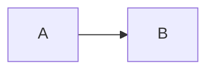

# @benjilegnard/reveal.js-mermaid-plugin

This is a [reveal.js](https://revealjs.com/) plugin to render [mermaid](http://mermaid.ai) diagrams.

Its main goal is to have modern ESM support for mermaid, allow you to embed any mermaid version (>=10), and use internal reveal.js types for typed configuration.


## Installation

```sh
npm i @benjilegnard/reveal.js-mermaid-plugin mermaid reveal.js
```

`mermaid` (>= 10) and `reveal.js` (>= 6) are peer dependencies.

## Usage

Register the plugin **after** `Markdown` and **before** `Highlight`: it needs the
markdown to be converted, and must replace the code blocks before highlight.js
processes them.

```ts
import Reveal from "reveal.js";
import Markdown from "reveal.js/plugin/markdown";
import Highlight from "reveal.js/plugin/highlight";
import Mermaid from "@benjilegnard/reveal.js-mermaid-plugin";

const deck = new Reveal({
  plugins: [Markdown, Mermaid, Highlight],
});

deck.initialize({
  // passed as is to mermaid.initialize()
  mermaid: {
    theme: "dark",
    // ... pass here any mermaid configuration
  },
});
```

Then write mermaid code blocks in your markdown slides:

````md

````

Each block is replaced by a `<div class="mermaid">` containing the inline SVG.
If a diagram fails to render, the error is logged in the console, the source
stays visible and its `<pre>` gets a `mermaid-error` class.

## TypeScript

Importing the plugin augments the reveal.js `RevealConfig` interface with a typed
`mermaid` key (`MermaidConfig` from mermaid), so `deck.initialize({ mermaid: ... })`
is type checked.

`reveal.js` type definitions use extensionless relative imports: they only resolve
with `"moduleResolution": "bundler"` (the Vite default). With `node16`/`nodenext`,
`RevealConfig` resolves to `any` and no option is checked.

## Alternatives

- <https://github.com/zjffun/reveal.js-mermaid-plugin> : (embeds an hard-coded old version of mermaidjs)
- <https://github.com/ludwick/reveal.js-mermaid-plugin> : (retired)
